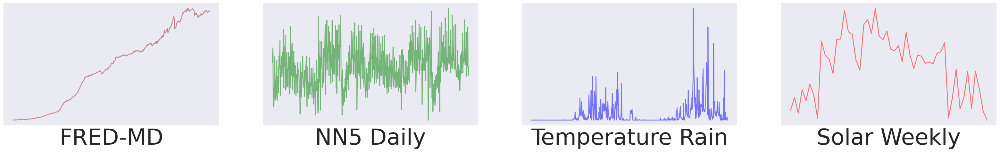

# Deep Latent State Space Models for Time-Series Generation


<div align="center">
  
  [](https://github.com/alexzhou907/ls4)
  [](https://pytorch.org/)
  [](https://github.com/alexzhou907/ls4/blob/main/LICENSE)

</div>

<p align="center">
  
</p>


Implementation of [Deep Latent State Space Models for Time-Series Generation](https://arxiv.org/abs/2212.12749) 

[Linqi Zhou](https://alexzhou907.github.io), [Michael Poli](https://zymrael.github.io/), [Winnie Xu](https://winniexu.ca/), [Stefano Massaroli](https://massaroli.site/), [Stefano Ermon](https://cs.stanford.edu/~ermon/)

## Requirements:

Install requirements via

```
$ pip install -r requirements.txt
```

Install extensions by
```
$ cd extensions/cauchy
$ python setup.py install
```

## Data

For generation, we use Monash Forecasting Repository, which can be downloaded [here](https://forecastingdata.org/).

We experiment with [NN5 Daily](https://zenodo.org/record/4656117), [FRED MD](https://zenodo.org/record/4654833), [Solar Weekly](https://zenodo.org/record/4656151), and [Temperature Rain](https://zenodo.org/record/5129091).

After download, put each `.tsf` file into your folder of choice. 

## Training and evaluation:

For training on generation for Monash,
```
$ python train_monash.py --config CONFIG
```
Please refer to `configs/monash/` folder for configs of each dataset. 

For training on interpolation/extrapolation,
```
$ python train_interp_extrap.py --config CONFIG
```
Please refer to `configs/interpolation/` and `configs/extrapolation/` for configs of each setting. 

The models will be evaluated periodically during training and produce relevant metrics in the paper.

## Reference

```
@inproceedings{zhou2023deep,
  title={Deep latent state space models for time-series generation},
  author={Zhou, Linqi and Poli, Michael and Xu, Winnie and Massaroli, Stefano and Ermon, Stefano},
  booktitle={International Conference on Machine Learning},
  pages={42625--42643},
  year={2023},
  organization={PMLR}
}
```

## Acknowledgement

For any questions related to codes and experiment setting, please contact [Linqi Zhou](linqizhou@stanford.edu). 